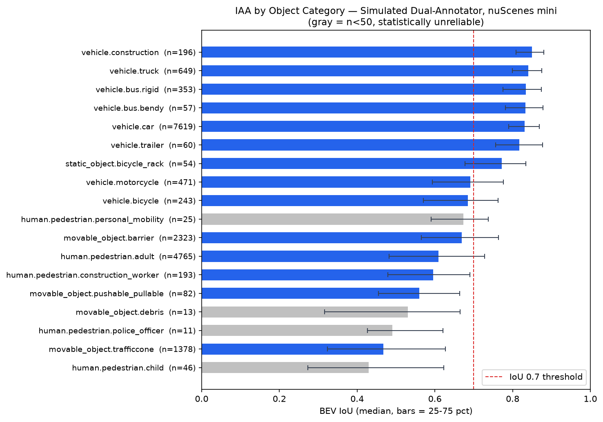
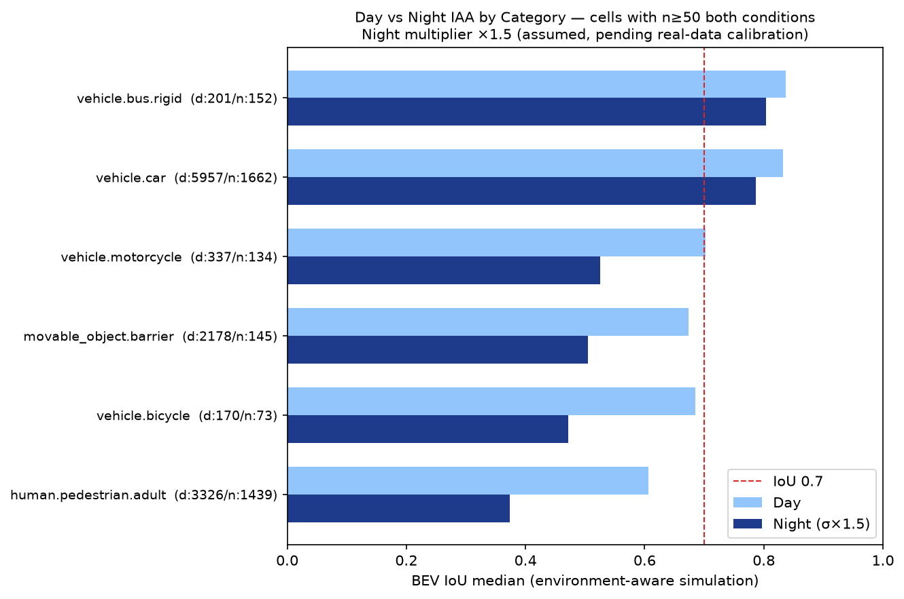

# Defining Data-Driven QA Thresholds for AV Annotation
## A nuScenes IAA Analysis — PM Portfolio Project

**Author:** Louise Wang  
**Date:** July 2026  
**Dataset:** nuScenes mini (v1.0-mini) | **Code:** [step2_iaa_analysis.ipynb]  
**TL;DR:** Uniform IoU thresholds systematically fail small, safety-critical 
object categories. This analysis proposes a size-stratified, 
condition-aware QA framework derived from simulated dual-annotator data.

---

## 1. Context & Problem

Autonomous vehicle companies spend millions annually on annotation, yet 
the pass/fail thresholds that govern data quality are rarely derived 
from first principles. Industry best practice calls for thresholds 
calibrated against model error feedback and regulatory requirements — 
but this assumes mature, data-rich operations. For companies in earlier 
stages, thresholds are often borrowed from academic benchmarks (KITTI's 
0.5, Waymo's 0.7) or set by engineering intuition, without validation 
against the company's own data distribution or cost structure.

The core question this project investigates: **can a single IoU threshold 
apply uniformly across all object categories and operational conditions — 
and if not, what should drive the differentiation?**

nuScenes was chosen as the analysis substrate for three reasons: its 
schema and devkit are fully open-sourced and reproducible; the mini 
subset (10 scenes, 18,538 annotations across 17 object categories) is 
large enough to surface structural patterns yet small enough to run a 
complete pipeline on a single machine; and its multi-category, 
multi-condition structure — spanning vehicle types, pedestrian 
sub-classes, and both daytime and nighttime scenes — directly 
stress-tests the uniformity assumption this project sets out to examine.

## 2. Methodology

### 2.1 Dataset
The analysis uses the nuScenes mini subset (v1.0-mini): 10 scenes, 
18,538 annotations across 17 of 23 defined object categories, drawn 
from Boston and Singapore driving environments. Only keyframe-linked 
annotations were used, as nuScenes sweeps carry no ground-truth labels.

### 2.2 Simulating a Second Annotator
Since nuScenes provides a single ground-truth annotation per object, 
a second annotator was simulated by applying controlled perturbations 
to each ground-truth bounding box. Three distortion types were applied 
to reflect real annotator error modes:
- **Additive position noise** (x, y): N(0, σ_pos) — absolute hand tremor, 
  independent of object size
- **Multiplicative size noise** (w, l, h): ×N(1, 5%), clipped to [0.8, 1.2] 
  — proportional estimation error
- **Semantic category confusion** (5% probability): restricted to 
  visually similar class pairs (e.g. adult ↔ construction_worker, 
  car ↔ truck) to reflect plausible human error rather than random noise

A fixed random seed (42) was set throughout to ensure reproducibility.

### 2.3 Parameter Calibration
The position noise parameter σ was calibrated by adjusting its value 
until the simulated IoU distribution matched the range reported for 
real dual-annotator AV datasets (median IoU 0.7–0.9). The initial value 
(σ = 0.20m) produced a median IoU of 0.68 — below target, with 30.6% 
of annotation pairs below 0.5. After one calibration iteration, 
σ = 0.12m yielded a median IoU of 0.768, with IoU < 0.5 dropping to 
14.6%. This value was locked as the final parameter.

### 2.4 Metrics
**BEV IoU** (Bird's Eye View, x-y plane projection) was selected over 
full 3D IoU for three reasons: it is 10× faster to compute; AV 
collision-avoidance decisions are primarily governed by the x-y plane; 
and it is the standard metric in nuScenes and Waymo detection benchmarks. 
Rotated rectangle intersection was computed using the Shapely library.

**Cohen's Kappa** was computed alongside IoU to separately diagnose 
category-level disagreement and control for chance agreement — 
raw category accuracy would be inflated given nuScenes' heavily 
imbalanced class distribution (vehicle.car alone accounts for 41% 
of annotations).

### 2.5 Environment-Aware Extension
A baseline simulation revealed that the position noise parameter σ 
was environment-blind: day and night scenes received identical 
perturbation, producing nearly identical IoU distributions (median 
0.766 vs 0.676 — a gap driven entirely by scene composition, 
not condition-aware modeling). To address this, σ was scaled by 
condition multipliers: ×1.5 for nighttime scenes and ×1.3 for 
post-rain scenes, reflecting reduced sensor fidelity and annotator 
confidence under degraded conditions. These multipliers are assumed 
values, pending calibration against real condition-stratified IAA data.

## 3. Findings

*Figure 1: BEV IoU median by object category. Gray = n<50. 
Red dashed line = IoU 0.7 threshold.*

**F1 & F2 — Size gradient and uniform threshold failure.**
The first chart ranks all object categories by median BEV IoU. 
The top 7 categories are all vehicles — physically large objects — 
and all exceed the 0.7 threshold. Moving downward, smaller objects 
(pedestrian subcategories, traffic cones) fall consistently below 0.7.

The reason is geometric: our simulated annotator applies a fixed 
position error of 0.12m. For a 2m-wide car, this represents a 6% 
displacement — barely affecting overlap. For a 0.3m traffic cone, 
the same 0.12m shifts the box by 40%, nearly breaking overlap entirely. 
Small objects are not harder to annotate because annotators try less — 
they are harder because the same hand error produces proportionally 
larger displacement relative to object size.

This exposes a structural problem with uniform thresholds: 
a 0.7 bar that is reasonable for vehicles becomes physically 
unreachable for small objects. Meanwhile, the two highest-frequency 
categories below the line — human.pedestrian.adult (n=4,765) and 
movable_object.trafficcone (n=1,378) — together represent 33% of 
all annotations. A threshold that fails one third of your data 
is not measuring quality; it is measuring geometry.

Additionally, the categories with the highest safety weight — 
human.pedestrian.child and human.pedestrian.police_officer — 
have fewer than 50 samples each (grayed out), meaning their 
quality cannot even be reliably measured, let alone improved.

*Figure 2: Day vs night BEV IoU by category. 
Night multiplier ×1.5 (assumed). Only cells with n≥50 shown.*

**F3 — Nighttime amplifies small-object vulnerability.**
The second chart applies the same size-gradient logic under a 
different variable: lighting condition. Nighttime scenes receive 
a σ multiplier of ×1.5, reflecting reduced annotator confidence 
under degraded conditions.

For large vehicles (car, bus), the day-to-night IoU drop is minimal 
(0.046 and 0.033). For small objects, the drop is severe: 
human.pedestrian.adult falls by 0.233, vehicle.bicycle by 0.214. 
The mechanism is identical to Figure 1 — multiplying σ by 1.5 
is still an absolute error increase, and absolute errors hurt 
small objects disproportionately.

The same ×1.5 multiplier that barely moves a car's IoU 
collapses a pedestrian's overlap by nearly a quarter. 
Night × small object is the quality danger zone.

**F4 — Small-sample cells produce irreproducible conclusions.**
When two lines of additional perturbation code (z and h distortion) 
were added to the simulation, vehicle.construction's nighttime 
iou_drop flipped sign — from negative to positive — with no parameter 
changes. The only thing that changed was the random number consumption 
sequence, equivalent to resampling with a different seed.

This is not a bug. It is evidence: a cell with n=11 cannot produce 
a stable conclusion. The number looks like a finding but behaves like 
noise. Any decision made from it — vendor penalty, QA escalation, 
resource allocation — would be chasing a number that reverses on the 
next data refresh.

**F5 — Coverage gaps concentrate on the highest-risk categories.**
human.pedestrian.child has only 46 annotations in the entire dataset, 
with zero nighttime samples. human.pedestrian.police_officer has 11. 
The dataset contains only one rainy scene, and it is nighttime — 
meaning rain and night effects are fully confounded, and no daytime 
rain data exists at all.

The pattern is structurally concerning: the categories where 
misclassification carries the highest safety consequence are also 
the ones with the least data and the hardest collection conditions. 
child and police_officer appear rarely in normal driving, and 
purposeful collection of these scenarios faces real operational 
constraints. This is not a nuScenes artifact — it reflects a 
fundamental tension in AV dataset design between safety priority 
and data availability.

## 4. Limitations

This section distinguishes what the framework reliably demonstrates 
from what requires real multi-annotator data to validate.

**L1 — Kappa reflects simulation parameters, not discovered disagreement.**
Cohen's Kappa = 0.936 is largely an echo of the 5% confusion rate 
built into the simulation: 95% of category assignments are identical 
by construction, compressing the chance-agreement correction. 
The pipeline is valid; the Kappa number should not be interpreted 
as a finding about real vendor disagreement rates.

**L2 — Environment multipliers are assumed, not measured.**
The nighttime (×1.5) and rain (×1.3) σ scaling factors are 
informed assumptions based on known sensor degradation under 
low-light and wet conditions. The relative ordering of condition 
severity is directionally credible; the absolute magnitudes require 
calibration against real condition-stratified annotator data.

**L3 — The simulation captures magnitude-type errors only.**
Gaussian perturbation models how much a box shifts or scales — 
it cannot model specification-type disagreement, where annotators 
make different but internally consistent choices under ambiguous 
guidelines (e.g., whether to include a bendy bus's articulation 
joint within the bounding box). Specification disagreement is 
arguably the more actionable failure mode in production; 
it requires real disagreement cases and qualitative root-cause 
analysis to surface.

**L4 — Dataset scope limits generalization.**
The mini subset covers 17 of 23 categories, two cities, 
and one confounded condition pair (rain nested entirely within night — 
no daytime rain scenes exist). Findings are structurally robust 
but should be validated on full nuScenes or a production dataset 
before informing SLA thresholds.

*Each limitation above has a clear upgrade path: L1–L2 resolve 
when real multi-annotator raw data replaces simulation; L3 resolves 
with a disagreement review process and labeled edge-case library; 
L4 resolves with targeted data collection (see R4).*

## 5. PM Recommendations

Before any of the following can work, there is one precondition: 
you need raw, independent annotations from your vendors,
not a merged final output, not their self-reported metrics. 
If you don't have that, you're measuring your own simulation, 
not their work. R5 is about making sure that data exists 
before you try to use it.

---

### R5 — Build the foundation first: three-layer verification 
and contract design

Most companies check vendor quality by asking vendors how good they are. 
That doesn't work. A vendor with high internal IAA can still be 
systematically wrong. If everyone on their team was trained 
the same wrong way, they'll agree with each other perfectly 
while disagreeing with reality.

The right structure is three layers:
- **Intra-vendor IAA**: are their annotators consistent with each other?
- **Vendor vs. gold standard**: is their output consistent with yours?
- **Inter-vendor**: if you use multiple vendors, do they agree?

High IAA alone only tells you the first layer. 
The dangerous failure mode is passing layer one while failing layer two,
consistent but systematically wrong. That's the hardest to catch 
because it looks like high quality.

To make this possible, the contract needs to require it upfront: 
5–10% of each batch must be double-blind annotated by independent 
annotators, vendors must deliver raw per-annotator outputs 
(not merged), and your team defines what gold standard means,
not theirs.

*Caveat: the tier structure is credible — the size gradient is a real 
geometric effect. But the specific threshold numbers need real 
annotator data before going into any SLA. Also: a lower threshold 
for small objects doesn't mean lower standards. It means the bar is 
set relative to what's actually achievable for that category. 
To prevent vendors from reading it as "small objects don't matter," 
pair lower IoU thresholds with higher gold standard sampling rates 
for those categories. Finally, keep the tier count to 3–4 maximum — 
more than that and the SLA becomes unenforceable.*

---

### R1 — Stop using one threshold for everything

A 0.7 IoU threshold makes sense for a 2-meter-wide car. 
For a 0.3-meter traffic cone, it's physically unreachable.
It's not because the annotator did a bad job, but because the same 
12cm hand error that barely moves a car's box displaces a cone's 
box by 40%. You're not measuring quality anymore; 
you're measuring object size.

The fix is straightforward: group categories into 3–4 size tiers 
and set a separate threshold for each. The threshold for each tier 
should be anchored to that tier's own IoU distribution, 
specifically around the 25th percentile, so that "failing" means 
genuinely underperforming relative to peers, not hitting a bar 
that was designed for a different object entirely.

*Caveat: the tier structure is credible — the size gradient is a real 
geometric effect. But the specific threshold numbers need real 
annotator data before going into any SLA. Also: a lower threshold 
for small objects doesn't mean lower standards. It means the bar is 
set relative to what's actually achievable for that category. 
To prevent vendors from reading it as "small objects don't matter," 
pair lower IoU thresholds with higher gold standard sampling rates 
for those categories. Finally, keep the tier count to 3–4 maximum — 
more than that and the SLA becomes unenforceable.*

---

### R2 — QA resources should go where the risk actually is

Aggregated metrics lie. Nighttime IoU of 0.676 looks only slightly 
worse than daytime's 0.766 — until you break it down: dry night 
is 0.747 (nearly normal), rain-night is 0.531 (collapsed). 
That gap disappears in the aggregate number.

The same pattern shows up across categories. Nighttime drops 
pedestrian.adult IoU by 0.233 and bicycle by 0.214. 
It drops car by 0.046. The risk is not evenly distributed — 
it's concentrated in specific condition × category combinations.

QA sampling should reflect this. Allocate 70–80% of your QA budget 
to the high-risk cells (night × small objects), and keep 20–30% 
as random coverage across all cells. The random portion matters: 
if vendors know exactly which cells get checked, they'll optimize 
for those and cut corners elsewhere. Random coverage makes the 
expected cost of underperforming anywhere non-zero.

For the dashboard: monitor every cell, but only intervene 
differentially on the top 3–5 highest-risk cells. 
Monitoring is cheap (it's just computation); 
differential intervention is expensive (it requires QA capacity). 
Keep them decoupled. Don't limit what you monitor 
just because you can't act on everything.

*Caveat: the ×1.5 night and ×1.3 rain multipliers are assumed. 
The relative ordering — night × small objects being the danger zone — 
is directionally solid; absolute numbers need real data to calibrate. 
Also note: condition × category fully expanded reaches dozens of cells. 
Running differentiated QA across all of them is not operationally 
feasible — which is exactly why monitoring and intervention 
need to be separated.*

---

### R3 — Don't let small samples produce false conclusions

vehicle.construction had n=11 in nighttime scenes. 
When we added two lines of code that shifted the random number sequence, 
its iou_drop flipped sign — from negative to positive — 
with no other changes. The number looked like a finding. 
It was noise.

Any cell below a minimum sample threshold shouldn't output a number. 
It should say "insufficient data." This applies at every level: 
grayed out in visualizations, blocked in reports, 
null in any automated system that might act on it.

*Caveat: n=50 is an experience-based starting point. The right way 
to set it is through sensitivity testing, find the minimum sample 
size where conclusions stop flipping across random seeds. 
Also: if too many cells show "insufficient data" for too long, 
people will start ignoring the system and making decisions by gut 
feeling. The guardrail only works if it's connected to R4,
every blocked cell should automatically feed into the collection 
priority list, so "insufficient data" is a temporary state, 
not a permanent disclaimer. Finally, don't just show a blank, 
show "current n / required n" so the gap itself is trackable.*

---

### R4 — Let the gaps drive your collection plan

The dataset has 46 child annotations. Zero of them are nighttime. 
There are no daytime rain scenes at all, rain and night 
are fully tangled together, so you can't even separate their effects.

These aren't random gaps. The categories with the least data 
are the ones where getting it wrong matters most: 
a misclassified child or a missed police officer directing traffic 
are not the same as a misclassified truck. 
But they're also the hardest to collect. 
Children don't appear often at night, 
and police officers only show up in specific high-stress situations.

The response to this isn't to just drive more miles and hope. 
It's to build a coverage gap scorecard: 
prioritize collection by safety weight × sample gap × 
condition coverage hole. The cells that R3 flags as 
"insufficient data" feed directly into this list.

*Caveat: of the three factors in the gap score, sample deficit and 
condition coverage holes can be measured objectively. Safety weight 
cannot, it's a value judgment that should be made at the safety 
leadership level, not by the data PM alone. Also: targeted collection 
will push your training set away from the natural distribution of 
real-world driving. Targeted subsets should be labeled separately, 
with sampling weights controlled by the ML team at training time, 
the collection decision and the weighting decision should stay 
decoupled. Finally, for the hardest scenarios (children at night, 
police officers on duty), natural collection is too slow. 
The realistic path is: natural collection first, then staged 
collection if needed, then synthetic data as a last resort — 
each step trades realism for speed and cost.*

---

## 6. What I'd Do Next

**With real vendor data:**
The pipeline structure stays intact: IoU calculation, Kappa, 
category-level aggregation, and the day/night breakdown all carry over 
directly. What changes is the input: the simulated second annotator 
gets replaced by real double-blind annotations from vendors, 
the Gaussian perturbation parameters become irrelevant, 
and the environment multipliers (currently assumed at ×1.5 and ×1.3) 
become measured values derived from real condition-stratified IAA data. 
The limitations in §4 resolve one by one as real data arrives.

**SQL layer:**
The current pipeline runs in pandas. A SQL layer (planned in DuckDB) 
would make the core aggregations queryable without re-running 
the notebook, enabling the kind of ad-hoc visibility that a 
production QA dashboard requires.

**Where this project hits its boundary:**
The simulation framework can model magnitude-type errors — 
how much a box shifts, scales, or rotates. It cannot surface 
specification-type disagreement, where annotators make different 
but internally consistent choices under ambiguous guidelines. 
That failure mode only appears in real disagreement data, 
and understanding how production teams handle it requires 
talking to people who've run these systems at scale.

The questions this project can't answer are the ones worth 
asking next: How do you run a disagreement review process? 
How does a labeling spec evolve when edge cases accumulate? 
How do you manage vendor behavior when they know the rules? 
Those questions live outside the data — and that's where 
the next conversations should go.

## Appendix

**Dataset:** nuScenes mini v1.0-mini  
**Code:** step2_iaa_analysis.ipynb (link to GitHub)  
**Key figures:** iaa_by_category.png / iaa_day_vs_night.png

**Fixed parameters:**
- Position noise σ = 0.12m (calibrated)
- Size noise σ = 5% (multiplicative)
- Yaw noise σ = 5°
- Category confusion rate = 5%
- Random seed = 42
- Night multiplier = ×1.5 (assumed)
- Rain multiplier = ×1.3 (assumed)
- Minimum cell size for reporting = n≥50

**Reproducibility:** All results reproducible by running 
step2_iaa_analysis.ipynb with the parameters above. 
Cell-level conclusions verified against random seed sensitivity 
(cells below n=50 fail this check and are masked).